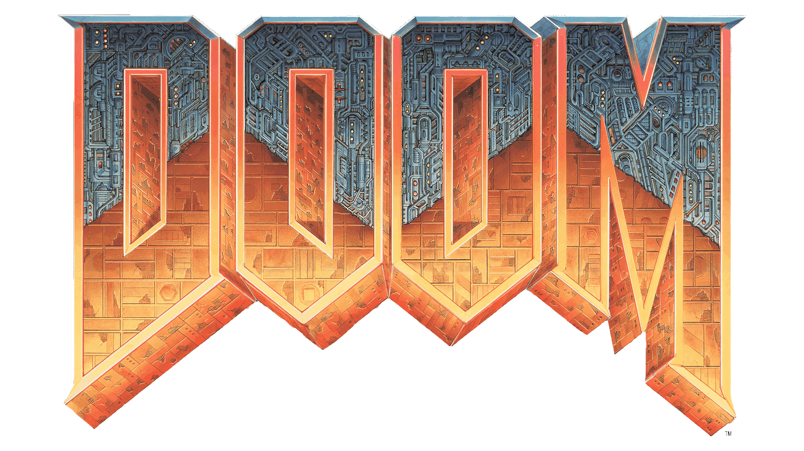
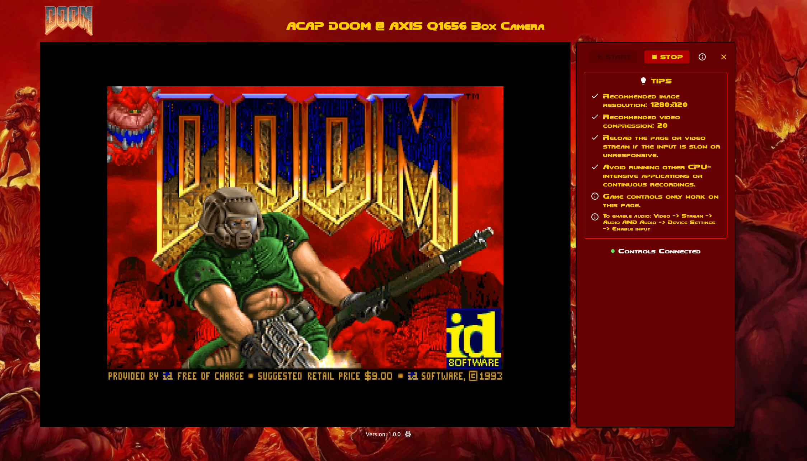
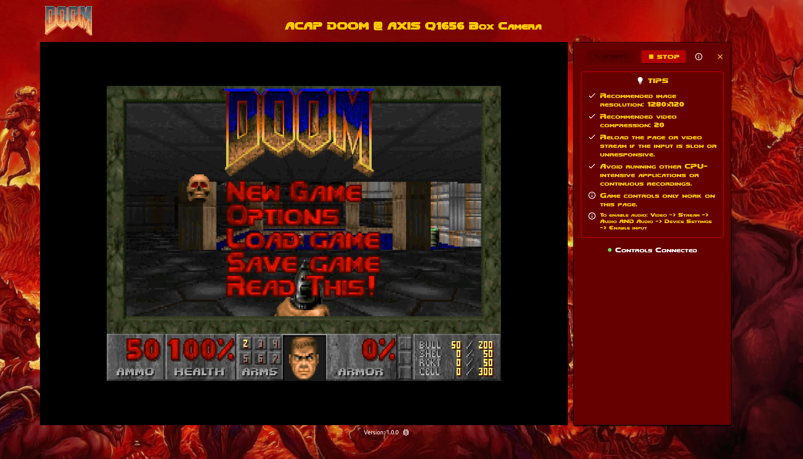

# ACAP DOOM

id Softwares classic FPS **Doom** for Axis network cameras. \
\
Running on **ARTPEC-7** and **ARTPEC-8** devices. \
Refer to your device manual to find out your platform. \
\
⚠️ Firmware should be **11.5** or later. \
\
**This application is made with no affiliation to Id Software or Axis Communications. \
Please read and respect the LICENSE.**

This application is intended to be built on a Linux or macOS system.

## ✅ Build Docker images

**Docker and Make must of course be installed first.**

```sh
make dockersetup
```

## ✅ Build the ACAP

**⚠️ NOTE** that you will need a WAD file to play and install the ACAP. \
Please read the **WAD File** section below.

For ARTPEC-7 devices:

```sh
make armv7hf
```

For ARTPEC-8 devices:

```sh
make aarch64
```

## ✅ Install ACAP

⚠️ You will need to enable unsigned ACAPs on the Apps page: **Allow unsigned apps**

Run ```setuptarget.sh``` to create ```credentials.json``` (requires jq to be installed) \
Set your Axis device IP in ```credentials.json``` and:

```sh
source setuptarget.sh && make install
```

Otherwise go to device web at:

```html
http://<YOUR_DEVICE_IP>/camera/index.html#/apps
```

and select ```Add app``` \
Upload the correct ```.eap``` file to the device to install it.

## ▶️ Play

Open the app website and press the **START** button.

## ⚠️ WAD file

WAD (which, according to the Doom Bible, is an acronym for "Where's All the Data?") is the file format used by Doom and all Doom-engine-based games for storing data.

The `WAD`-file used in ACAP Doom is the shareware version of Doom (`doom1.wad`, version 1.9, SHA-1 `5b2e249b9c5133ec987b3ea77596381dc0d6bc1d`).

`doom1.wad`, will automatically be downloaded when running ```make dockersetup``` \
When building the ACAP it will be copied to the project directory.

The WAD file to be included in the ACAP is specified in package.conf under "OTHERFILES". \
**🚨 IT SHOULD BE PLACED IN THE SAME DIRECTORY AS THIS README FILE 🚨**

More about `doom1.wad` here: <https://doomwiki.org/wiki/DOOM1.WAD>

## Expert users: add your own WAD

Put it in:

```sh
/usr/local/packages/acap_doom
```

## Expert users: Development

Check available build commands and helpers:

```sh
make help
```

To just build the application binary for current arch:

```sh
// Will build with debug symbols:
FINAL=n make build

// Deploy debug binary to target:
FINAL=n make deploy
```

Build and deploy the web code (requires Node.js and Yarn to be installed):

```sh
make web

// Deploy the ACAP web to target:
make deployweb
```

Trace logs on current sourced target device (requires Python with paramiko and scp):

```sh
make log
```

## ❔ FAQ

## Frequently Asked Questions

### Q: Why are the controls slow or unresponsive?

**A:** Please try turning off other running ACAPs and lowering the stream resolution.

### Q: Why does it not work on my device?

**A:** Unfortunately, it has not been tested on all devices.

### Q: Why does it not install?

**A:** You will need to enable unsigned ACAPs on the Apps page: **Allow unsigned apps**

### Q: Why am I not hearing any sounds?

**A:** Ensure that audio is enabled in both **Video -> Stream -> Audio** and **Audio -> Device Settings -> Enable input**.

### Q: Why is there no music?

**A:** Music support has not been implemented yet.

### Q: Does it only work on devices with an Artpec chip?

**A:** Yes, it currently only works on devices with an Artpec chip.

### Q: What is the purpose of this?

**A:** This project is intended for testing what is possible on a surveillance camera with an open SDK for apps.

## 🖼️ Screenshots




## ⭐ Credits

**All assets are the properties of their respective owners.**

- id Software DOOM: <https://github.com/id-Software/DOOM>
- Doom wallpaper: <https://www.wallpaperflare.com/doom-wallpaper-doom-2016-video-games-doom-game-crowd-wallpaper-pbidr>
- Doom logo: <https://logos.fandom.com/wiki/Doom_(1993_video_game)>
- Doom font: <https://www.dafont.com/doom.font>
- Doom cursors: <http://www.rw-designer.com/cursor-set/doom-1>
- Libwebsockets: <https://libwebsockets.org/>
- PipeWire: <https://pipewire.org/>
- React: <https://react.dev/>
- Material UI: <https://mui.com/>
