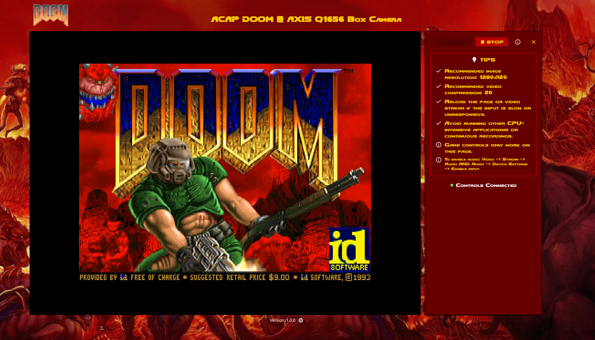

# ACAP DOOM

id Software's classic FPS **Doom** for Axis network cameras. \
\
Running on **ARTPEC-7** and **ARTPEC-8** devices. \
Refer to your device manual to determine your platform. \
\
⚠️ Firmware should be **11.5** or later.

> **⚠️ Important:** This application is **not affiliated** with Id Software or Axis Communications. \
> **Please read and respect the LICENSE** to ensure compliance.

This application is intended to be built on a Linux or macOS system.

## ✅ Build Docker images

**[Docker](https://docs.docker.com/engine/install/) and Make must be installed before proceeding.**

```sh
make dockersetup
```

This might take some time, as all the resources required for the application need to be built.

## ✅ Build the ACAP

**⚠️ NOTE** that you will need a WAD file to play and install the ACAP. \
Please read the [**WAD File**](#wad-file) section below.

For ARTPEC-7 devices:

```sh
make armv7hf
```

For ARTPEC-8 devices:

```sh
make aarch64
```

This might also take some time, as we need to build both the application and the web UI.

## ✅ Install the ACAP

⚠️ You will need to enable unsigned ACAPs on the Apps page: **Allow unsigned apps**

Run ```setuptarget.sh``` to create ```credentials.json``` (requires `jq` to be installed) \
Set your Axis device IP in ```credentials.json``` and:

```sh
source setuptarget.sh && make install
```

Otherwise, go to the device web interface at:

```html
http://<YOUR_DEVICE_IP>/camera/index.html#/apps
```

and select ```Add app``` \
Upload the correct ```.eap``` file to the device to install it.

## ▶️ Run the ACAP

Open the app website and press the **START** button.

## WAD file

WAD (which, according to the Doom Bible, is an acronym for "Where's All the Data?") \
is the file format used by Doom and all Doom-engine-based games for storing data.

The `WAD`-file used in ACAP Doom is the shareware version of Doom (`doom1.wad`, version 1.9, SHA-1 `5b2e249b9c5133ec987b3ea77596381dc0d6bc1d`).

`doom1.wad`, will automatically be downloaded when running ```make dockersetup``` \
When building the ACAP it will be copied to the project directory.

The WAD file to be included in the ACAP is specified in `package.conf` under ```OTHERFILES```. \
**🚨 WAD SHOULD BE PLACED IN THE SAME DIRECTORY AS THIS README FILE 🚨**

More about `doom1.wad` here: <https://doomwiki.org/wiki/DOOM1.WAD>

## Expert users: Add your own WAD file

Place your WAD file in the following directory on the device:

```sh
/usr/local/packages/acap_doom
```

**Note:** Not all WAD files have been tested.

## Expert users: Development

Check available build commands and helpers:

```sh
make help
```

To just build the application binary for current arch:

```sh
// Will build with debug symbols:
FINAL=n make build

// Deploy debug binary to target:
FINAL=n make deploy
```

Build and deploy the web code (requires Node.js and Yarn to be installed):

```sh
make web

// Deploy the ACAP web to target:
make deployweb
```

Trace logs on current sourced target device (requires Python with paramiko and scp):

```sh
make log
```

## ❔ FAQ

### Q: What is "ACAP"?

**A:** AXIS Camera Application Platform: An open application platform for software-based solutions built around Axis devices.
More info [here](https://www.axis.com/developer-community/open-source/acap).

### Q: Why can't I control the game?

**A:** Controls only work within the ACAP Doom webpage.

### Q: Why are the controls slow or unresponsive?

**A:** There are a few steps you can take to improve the responsiveness of your game input:

1. **Try turning off other running ACAPs.**
2. **Reload the video stream or the application UI.**
3. **Lower the stream resolution.**
4. **Ensure you are on the same network as your device for optimal performance.**

### Q: Why does it not work on my device?

**A:** Unfortunately, it has not been tested on all devices yet.

### Q: Which browsers are supported?

**A:** The application is tested on the latest versions of Chrome and Firefox.

### Q: Why does it not install?

**A:** You will need to enable unsigned ACAPs on the Apps page: **`Allow unsigned apps`**
Also ensure that the application matches the device architecture.

### Q: Why am I not hearing any sounds?

**A:** Ensure that audio is enabled in both **`Video -> Stream -> Audio`** and **`Audio -> Device Settings -> Enable input`**.

### Q: Why is there no music?

**A:** Music support has not been implemented yet.

### Q: Does it only work on devices with an Artpec chip?

**A:** Yes, it currently only works on devices with an Artpec-7 chip or later.

### Q: What is the purpose of this?

**A:** This project is intended to test what is possible on a surveillance camera with an open SDK for apps.

## 🖼️ Screenshots




## ⭐ Credits

**All assets, libraries, and tools are the properties of their respective owners.**

- id Software DOOM: <https://github.com/id-Software/DOOM>
- Doom wallpaper: <https://www.wallpaperflare.com/doom-wallpaper-doom-2016-video-games-doom-game-crowd-wallpaper-pbidr>
- Doom logo: <https://logos.fandom.com/wiki/Doom_(1993_video_game)>
- Doom font: <https://www.dafont.com/doom.font>
- Doom cursors: <http://www.rw-designer.com/cursor-set/doom-1>
- Libwebsockets: <https://libwebsockets.org/>
- PipeWire: <https://pipewire.org/>
- React: <https://react.dev/>
- Material UI: <https://mui.com/>
